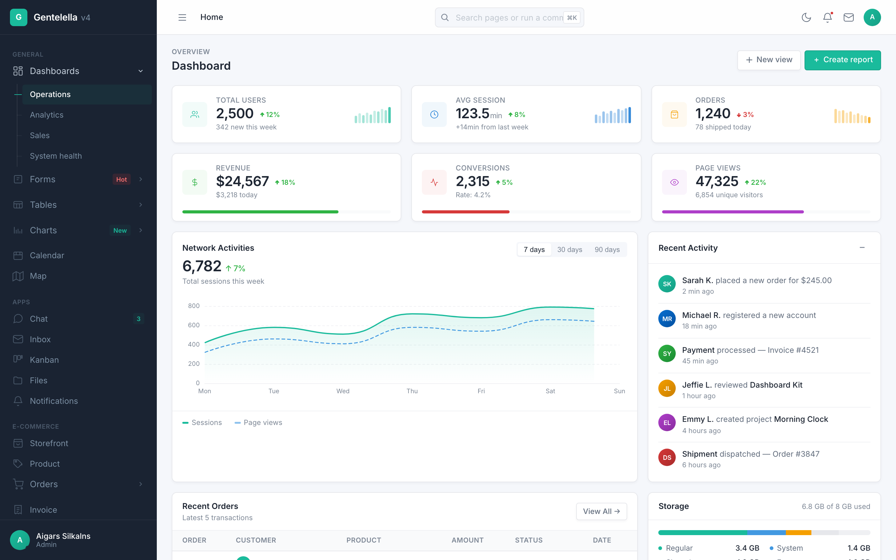
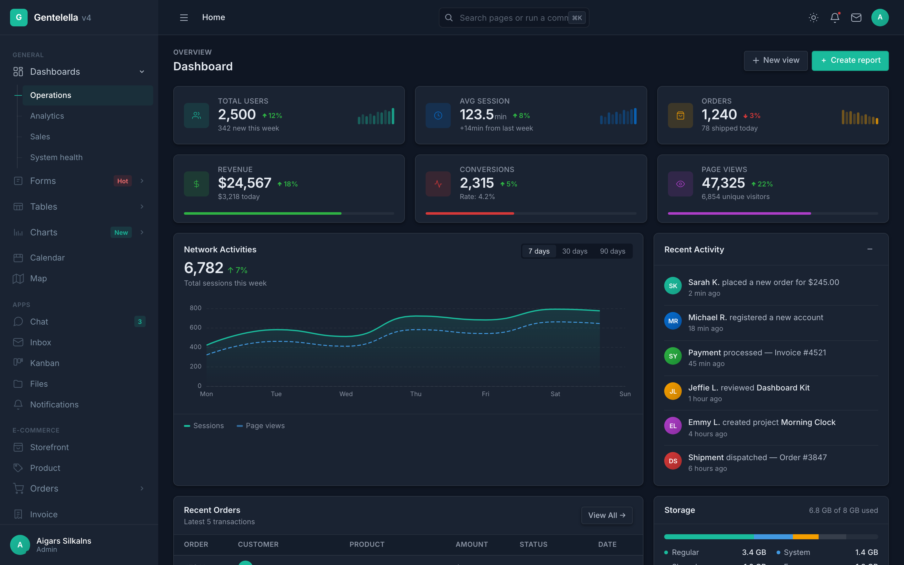
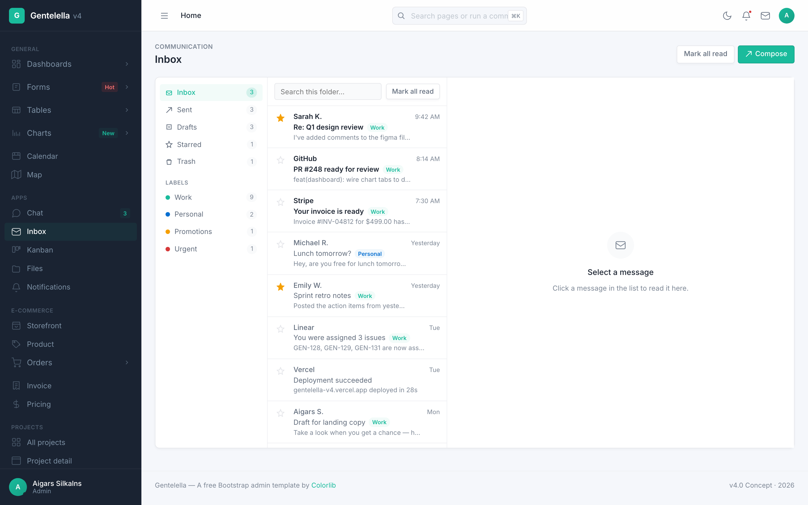
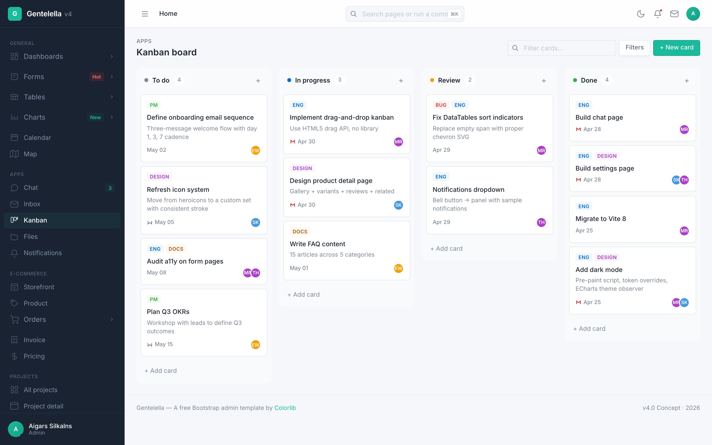
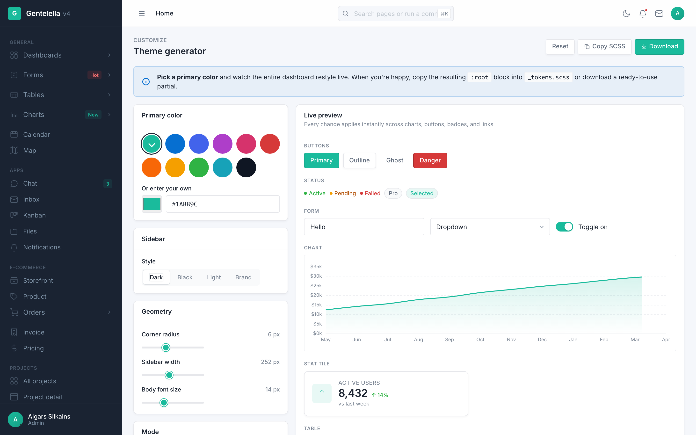

# Gentelella v4 — Free Admin Dashboard Template

[](LICENSE.txt)
[](CHANGELOG.md)
[](https://vitejs.dev/)
[](#tech-stack)
[](#tech-stack)

**Gentelella v4** is a free, open-source **admin dashboard template** built with **vanilla JavaScript**, **SCSS**, and **Vite 8**. **No Bootstrap. No jQuery. No SPA framework.** A modern alternative to Bootstrap admin templates for SaaS dashboards, CRM systems, internal tools, e-commerce backends, and project management apps.

**58 production-ready HTML pages**, **20 ECharts chart variants**, fully interactive **inbox / kanban / calendar / file manager / settings**, a **live theme generator**, a **component playground**, a **⌘K command palette**, **dark mode**, and **PWA support**. MIT-licensed. Free for personal and commercial use.

Built for 2026 by [Colorlib](https://colorlib.com). **[Live demo →](https://preview.colorlib.com/theme/gentelella/)**

<p align="center">
  
  
</p>

<p align="center">
  <em>Inbox · Kanban · Theme generator</em><br>
  
  
  
</p>

> **Generate your own screenshots** — `npm run build && npm run screenshots` boots Playwright and captures 22 key pages × light + dark = 44 PNGs to `docs/screenshots/`.

---

## Why Gentelella v4

The original Gentelella has been a free Bootstrap admin template since 2014 — **3M+ downloads**, [4.5k+ GitHub stars](https://github.com/ColorlibHQ/gentelella). v4 is a ground-up redesign:

- **No Bootstrap, no jQuery** — vanilla JavaScript + SCSS. ~178 MB `node_modules` (down from ~600 MB on v2).
- **Vite 8 build system** — instant HMR, multi-page app with auto-discovered entry points, hashed assets.
- **Light + dark mode** with `prefers-color-scheme` detection and pre-paint script (no flash of incorrect theme).
- **PWA-ready** — installable on desktop and mobile, offline shell, service worker.
- **AI-assisted development** — ships with helper files for Claude Code, Cursor, GitHub Copilot, and any [agents.md](https://agents.md)-compatible tool.

Perfect for: **SaaS dashboards**, **CRM**, **ERP**, **internal admin panels**, **project management tools**, **e-commerce backends**, **analytics dashboards**, **HR/payroll**, **booking systems**, **content management**.

## Features

- **🎨 Live theme generator** — pick a primary color, watch every chart, button, badge, and link restyle in real time. Copy or download the generated SCSS tokens. Demo: [theme.html](https://preview.colorlib.com/theme/gentelella/theme.html)
- **🧪 Component playground** — every reusable component on one page, side-by-side with its **exact HTML** and a Copy button. Demo: [playground.html](https://preview.colorlib.com/theme/gentelella/playground.html)
- **⌘K command palette** — fuzzy search across all 58 pages and inline actions
- **📬 Real inbox client** — folders, reader pane, compose modal, reply/forward, J/K/R/S/# keyboard shortcuts, search across the active folder
- **📱 PWA** — installable on macOS / Windows / iOS / Android, offline shell, service worker
- **↔️ Sidebar rail mode** — desktop hamburger collapses sidebar to icon-only with hover tooltips and click-to-flyout submenus
- **🌗 Dark mode** — `prefers-color-scheme` aware, pre-paint script prevents flash, manual toggle persists in `localStorage`
- **♿ Accessibility** — skip-link, keyboard focus rings, ARIA labels on interactive controls, semantic landmarks, screen-reader-friendly DataTables

## What you get

| Surface | What's in it |
| --- | --- |
| **Dashboards** | 4 variants — operations, analytics (heatmap, funnel, cohort matrix), sales (gauge, radar, pipeline), system health (resource bars, deployment list, error log) |
| **Auth** | Sign-in · social (Google, GitHub) · register · forgot password · 2FA · lock screen · 403 / 404 / 500 |
| **Forms** | General form · advanced controls · 6-step wizard · drag-and-drop upload · validation · **date-range picker · multi-select · rich text editor** |
| **Tables** | DataTables — sort, search, paginate, **row selection, CSV export** · 23-row + 50-row demos |
| **Charts** | **20 ECharts variants** — line, area, stacked area, bar, horizontal bar, mixed bar/line, donut, pie, radar, gauge, scatter, heatmap, funnel, candlestick, polar bar, treemap, sankey, calendar heatmap, gantt + dashboard mini-line |
| **App pages** | Calendar (full CRUD) · inbox (folders, compose, reader) · chat (8 threads) · kanban (drag-drop) · file manager (tree + grid) · notifications · invoice (editable line items) · profile · settings (persisted) · FAQ |
| **E-commerce** | Storefront · product detail · order list · order detail · pricing tiers |
| **Admin** | Contacts · user management (search, filters, role editor) · maintenance · coming-soon |
| **UI library** | **Component playground** · **theme generator** · 120+ icons in 14 categories · typography · 18 widget variants · media gallery · general elements (banners, accordion, drawer, popover, timeline) |
| **Map** | Leaflet customer map |
| **Marketing** | Landing page with hero, stats band, features, showcase, testimonials, FAQ |
| **Layouts** | Fixed sidebar / fixed footer / nested page / blank starter |

Plus: 10 SCSS partials · build-time + runtime shell (no FOUC) · `data-page` attribute auto-highlights nav · mobile drawer + desktop rail mode · light/dark with `prefers-color-scheme` + pre-paint · cross-document view transitions · skip-to-content · keyboard focus-visible · accordion sidebar with sessionStorage memory · `localStorage`-persisted settings · per-page **`<meta description>`**, **Open Graph**, and **Twitter Card** tags auto-injected at build time.

## Upgrade to a Premium Dashboard

Need advanced features, dedicated support, and production-ready code? Explore our handpicked collection of professional admin templates on [DashboardPack](https://dashboardpack.com/?utm_source=github&utm_medium=readme&utm_campaign=gentelella).

<table>
  <tr>
    <td align="center" width="50%">
      <a href="https://dashboardpack.com/theme-details/apex-nextjs/?utm_source=github&utm_medium=readme&utm_campaign=gentelella">
        
      </a>
      <br>
      <a href="https://dashboardpack.com/theme-details/apex-nextjs/?utm_source=github&utm_medium=readme&utm_campaign=gentelella"><strong>Apex</strong></a>
      <br>
      <sub>Next.js 16 + React 19 + Tailwind CSS v4. 50+ pages, full CRUD, live theme customizer, 5 dashboard variants.</sub>
    </td>
    <td align="center" width="50%">
      <a href="https://dashboardpack.com/theme-details/zenith-nextjs/?utm_source=github&utm_medium=readme&utm_campaign=gentelella">
        
      </a>
      <br>
      <a href="https://dashboardpack.com/theme-details/zenith-nextjs/?utm_source=github&utm_medium=readme&utm_campaign=gentelella"><strong>Zenith</strong></a>
      <br>
      <sub>Next.js 16 + React 19 + Tailwind CSS v4. Achromatic design, drag-and-drop kanban, i18n, RTL support.</sub>
    </td>
  </tr>
  <tr>
    <td align="center" width="50%">
      <a href="https://dashboardpack.com/theme-details/haze-dashboard-nuxt/?utm_source=github&utm_medium=readme&utm_campaign=gentelella">
        
      </a>
      <br>
      <a href="https://dashboardpack.com/theme-details/haze-dashboard-nuxt/?utm_source=github&utm_medium=readme&utm_campaign=gentelella"><strong>Haze</strong></a>
      <br>
      <sub>Nuxt 4 + Nuxt UI v4 + Tailwind CSS v4. 92+ pages, 7 layouts, 5 dashboards, RTL, i18n, mock API layer.</sub>
    </td>
    <td align="center" width="50%">
      <a href="https://dashboardpack.com/theme-details/tailpanel/?utm_source=github&utm_medium=readme&utm_campaign=gentelella">
        
      </a>
      <br>
      <a href="https://dashboardpack.com/theme-details/tailpanel/?utm_source=github&utm_medium=readme&utm_campaign=gentelella"><strong>TailPanel</strong></a>
      <br>
      <sub>React + TypeScript + Tailwind CSS + Vite. 9 dashboard designs, dark and light themes.</sub>
    </td>
  </tr>
  <tr>
    <td align="center" width="50%">
      <a href="https://dashboardpack.com/theme-details/admindek-html/?utm_source=github&utm_medium=readme&utm_campaign=gentelella">
        
      </a>
      <br>
      <a href="https://dashboardpack.com/theme-details/admindek-html/?utm_source=github&utm_medium=readme&utm_campaign=gentelella"><strong>Admindek</strong></a>
      <br>
      <sub>Bootstrap 5 + vanilla JS. 100+ components, dark/light modes, RTL support, 10 color presets.</sub>
    </td>
    <td align="center" width="50%">
      <a href="https://dashboardpack.com/theme-details/svelteforge-premium/?utm_source=github&utm_medium=readme&utm_campaign=gentelella">
        
      </a>
      <br>
      <a href="https://dashboardpack.com/theme-details/svelteforge-premium/?utm_source=github&utm_medium=readme&utm_campaign=gentelella"><strong>SvelteForge Premium</strong></a>
      <br>
      <sub>SvelteKit + Tailwind CSS v4. 30+ wired-up modules, multi-tenant from row zero, dark/light/system mode.</sub>
    </td>
  </tr>
</table>

<p align="center">
  <a href="https://dashboardpack.com/?utm_source=github&utm_medium=readme&utm_campaign=gentelella"><strong>View All Premium Templates →</strong></a>
</p>

## Tech stack

- **Vite 8** with Rolldown — multi-page app, 58 auto-discovered entry points
- **SCSS** with `@use` modules — no Bootstrap, no framework
- **Vanilla ES2022** — no jQuery, no SPA framework, no build-time JSX
- **Apache ECharts 6** — lazy-imported, modular (only chart types actually used)
- **DataTables.net 2** core — re-skinned from scratch to match the design system
- **Leaflet 1.9** — lazy-imported on the map page only
- **Inter** font from Google Fonts
- **Playwright** (devDep) — for the screenshot pipeline and smoke tests

3 production deps, 9 dev deps, **~178 MB `node_modules`** (was ~600 MB on the old Gentelella).

## Documentation

Comprehensive docs in [`docs/`](docs/) covering every part of v4:

| Topic | Doc |
| --- | --- |
| Setup, build, deploy | [getting-started](docs/getting-started.md) |
| Directory layout | [project-structure](docs/project-structure.md) |
| Shell injection + lazy modules | [architecture](docs/architecture.md) |
| Tokens, dark mode, theme generator | [theming](docs/theming.md) |
| Adding pages + sidebar entries | [pages](docs/pages.md) |
| Buttons, cards, badges, grids | [components](docs/components.md) |
| ECharts factories | [charts](docs/charts.md) |
| DataTables, row selection, CSV | [tables](docs/tables.md) |
| Inputs, validation, custom controls | [forms](docs/forms.md) |
| `showModal`, `showToast`, `openMenu` | [overlays](docs/overlays.md) |
| ⌘K | [command-palette](docs/command-palette.md) |
| Inbox / kanban / calendar / files / settings | [app-modules](docs/app-modules.md) |
| Service worker, manifest, offline | [pwa](docs/pwa.md) |
| Hosts, subpath, cache headers | [deployment](docs/deployment.md) |
| IntelliSense via `.d.ts` | [typescript](docs/typescript.md) |
| Seed vs HTTP backend (`?api=1`) | [data-adapter](docs/data-adapter.md) |
| Coming from old Gentelella | [migration-v2](docs/migration-v2.md) |
| Common questions | [FAQ](docs/faq.md) |

## Quick start

```bash
git clone https://github.com/ColorlibHQ/gentelella.git
cd gentelella
npm install
npm run dev
```

Open [http://localhost:9173/production/index.html](http://localhost:9173/production/index.html). The dev server hot-reloads SCSS, JS, and HTML. Override the port with `PORT=4000 npm run dev`.

### Production build

```bash
npm run build
```

Outputs static HTML + hashed JS/CSS to `dist/`. Deploy the `dist/` folder to any static host (Netlify, Vercel, Cloudflare Pages, S3, GitHub Pages).

To deploy under a subpath (e.g. `https://example.com/admin/`):

```bash
BASE_PATH=/admin/ npm run build
```

### npm package

The package is consumable as an npm dependency for granular imports:

```bash
npm install gentelella
```

```js
import { mountShell, showModal, showToast } from 'gentelella';
import 'gentelella/scss/v4/main.scss';
```

Subpath exports: `gentelella/v4/*` (JS modules), `gentelella/scss/*` (styles), `gentelella/types` (TypeScript declarations).

### Scripts

```text
npm run dev              Start Vite dev server (port 9173)
npm run build            Production build to dist/
npm run build:dev        Non-minified build (debugging)
npm run preview          Serve dist/ to preview the production build (port 9174)
npm run analyze          Build + open the bundle treemap
npm run new -- <slug>    Scaffold a new page (see `--help` for flags)
npm run screenshots      Boot Playwright + capture 44 PNGs to docs/screenshots/
npm run smoke            Boot dev server, hit every page, assert HTTP 200
npm run deploy:preview   Build + sync to R2 with per-file cache headers
npm run lint             ESLint across src/
npm run format           Prettier write across src/
```

## AI-assisted development

Gentelella v4 ships with helper files for the major AI coding tools — drop the repo open in any of them and the assistant gets immediate, accurate context about the architecture, conventions, and recipes:

| Tool | File |
| --- | --- |
| **Claude Code** | [`CLAUDE.md`](CLAUDE.md) |
| **Cursor** | [`.cursor/rules/project.mdc`](.cursor/rules/project.mdc) |
| **GitHub Copilot** | [`.github/copilot-instructions.md`](.github/copilot-instructions.md) |
| **Aider, Cline, Codex, Continue** (and other [agents.md](https://agents.md) tools) | [`AGENTS.md`](AGENTS.md) |

Each file documents the hard rules (vanilla DOM only, single entry point, shell opt-in via body attributes, NAV as one constant, overlay helpers, CSS custom properties for colors, subpath-safe URLs), anti-patterns to avoid, and copy-pasteable recipes for adding pages, charts, modals, and toasts.

## Project layout

```text
src/
├── main-v4.js                 Entry — mounts shell, initializes charts/tables
├── v4/
│   ├── shell.js               Runtime: mobile drawer, theme toggle, dropdowns
│   ├── shell-render.js        Pure: nav config + sidebar/topbar/footer HTML
│   ├── charts.js              ECharts factories (revenue, sales, donut, …)
│   ├── tables.js              DataTables init for [data-datatable]
│   ├── menus.js               Popover menus + side panels
│   ├── modal.js               Modal dialog system
│   ├── toast.js               Toast notifications
│   ├── command-palette.js     ⌘K fuzzy search
│   ├── calendar.js            Month-grid calendar
│   ├── inbox.js               Inbox folder + message list
│   ├── kanban.js              Drag-and-drop kanban board
│   ├── file-manager.js        Tree + grid file browser
│   ├── form-controls.js       Date range, multi-select, rich text
│   ├── settings.js            localStorage-backed settings page
│   ├── details.js             Project / order / contact detail panels
│   ├── markup.js              Pure string helpers for JS-rendered content
│   ├── data-adapter.js        Seed + HTTP adapters for backend hydration
│   ├── product-images.js      Product gallery zoom
│   └── product-mockups.js     SVG product mockups
└── scss/v4/
    ├── main.scss              @use aggregator
    ├── _tokens.scss           CSS custom properties (colors, sidebar, fonts, radii)
    ├── _layout.scss           Sidebar, topbar, main, grid, footer, responsive
    ├── _components.scss       Buttons, cards, tables, status, toggles, progress
    ├── _forms.scss            Inputs, selects, validation, input groups
    ├── _widgets.scss          Stat cards, activity, donuts, sparklines, todos
    ├── _pages.scss            Pagination, alerts, calendar, inbox, invoice, …
    ├── _datatable.scss        DataTables UI overrides
    ├── _auth.scss             Login + error layouts
    └── _apps.scss             Chat, kanban, file manager, settings

production/                    58 entry HTML pages — one per surface
public/                        Static assets copied as-is
dist/                          Build output (gitignored)
types/gentelella.d.ts          TypeScript declarations
docs/getting-started.md        5-minute setup guide
vite.config.js                 Multi-page Vite config
```

## Customization

### Design tokens

Every color, radius, sidebar dimension, and font setting lives as a CSS custom property in [`src/scss/v4/_tokens.scss`](src/scss/v4/_tokens.scss). Edit `:root`, save, the Vite dev server reloads.

Want a different brand color? Change `--primary` and `--primary-dk`. Every chart, every button, every active nav item updates — ECharts reads these variables at chart-init time.

### Adding a page

The fast way:

```sh
npm run new -- reports --title "Reports" --pretitle "Admin" \
  --breadcrumb "Home > Admin > Reports" --nav-group "Admin" --icon "profile"
```

This creates `production/reports.html` with the standard skeleton and (with `--nav-group`) inserts a sidebar entry into the `NAV` array of [`src/v4/shell-render.js`](src/v4/shell-render.js). Vite auto-discovers the new entry — no config change needed. Run `npm run new -- --help` for all options, or use `--dry-run` to preview without writing.

The manual way:

1. Copy any existing page in `production/` (e.g. `profile.html`) as your starting point.
2. Update the `<title>`, `data-page`, and `data-breadcrumb` attributes.
3. Replace the `<main>` content with your markup using the v4 components.
4. Optionally add a new sidebar item by editing the `NAV` array in [`src/v4/shell-render.js`](src/v4/shell-render.js).

The shell auto-marks the matching nav item active based on `data-page`.

### Adding a chart

Add a factory function to [`src/v4/charts.js`](src/v4/charts.js) following the `revenueLine` / `salesBar` pattern, register it in the `charts` map, then drop a `<div data-chart="your-name" style="width:100%;height:300px"></div>` into any page. Colors come from the design tokens automatically.

### Adding a sortable table

Mark up a regular `<table class="table" data-datatable>` with `<thead>` and `<tbody>`. The init runs automatically. Use `<th data-orderable="false">` to disable sorting on a column, and `data-page-length="25"` on the table to change the page size.

### Sidebar navigation

The sidebar is rendered from a single source — the `NAV` array in [`src/v4/shell-render.js`](src/v4/shell-render.js). Edit there, every page updates.

### TypeScript / IntelliSense

Type declarations for the public JS surface ship in [`types/gentelella.d.ts`](types/gentelella.d.ts) and are wired up via the `types` field in `package.json`. VS Code resolves IntelliSense automatically — no `tsconfig` required, no rewrite. Covers `mountShell`, `showModal`, `showToast`, `openMenu`, `seedAdapter`/`httpAdapter`, chart/table init, and the `NAV` schema.

### Markup helpers

For pages that build content from data (orders rows, inbox threads, kanban cards), [`src/v4/markup.js`](src/v4/markup.js) exposes pure string-returning helpers — `statTile()`, `statusBadge()`, `customerCell()`, `activityItem()`, `visitorRow()`, `emptyState()`, `banner()`, `skeletonRows()`, plus `escapeHtml()`. Live examples on the [Playground](https://preview.colorlib.com/theme/gentelella/playground.html#helpers-intro). Static pages keep their hand-written HTML — these are for JS-driven content where the boilerplate adds up.

## SEO and metadata

Every page is built with SEO in mind:

- **Semantic HTML5** — `<main>`, `<nav>`, `<aside>`, `<header>`, semantic `<h1>` page titles
- **Per-page `<meta description>`** auto-derived from the breadcrumb
- **Open Graph + Twitter Card** tags injected at build time
- **PWA manifest** + theme-color (light + dark variants)
- **Pre-paint theme script** — eliminates flash of incorrect theme on load
- **Skip-to-content link** + ARIA landmarks for screen reader navigation
- **`Cache-Control`-aware deploy** ([`scripts/deploy-preview.sh`](scripts/deploy-preview.sh)) — long-cache for hashed assets, short-cache for HTML, no-cache for service worker

## Deployment

Static template — deploy `dist/` anywhere that serves files.

| Host | Notes |
| --- | --- |
| **Netlify / Vercel / Cloudflare Pages** | Drop in, no config needed. Set `BASE_PATH=/` (default). |
| **GitHub Pages** | `BASE_PATH=/your-repo/ npm run build`, push `dist/` to `gh-pages`. |
| **S3 / CloudFront** | Upload `dist/`. Set the bucket as a static site, point CloudFront at it. |
| **Any nginx / Apache** | `cp -r dist/* /var/www/html/`. |
| **Cloudflare R2** | Use the built-in [`npm run deploy:preview`](scripts/deploy-preview.sh) for per-file cache headers. |

No backend. No environment variables required (other than `BASE_PATH` if you're deploying under a subpath).

## What's intentionally NOT included

- **No backend.** Forms post to `#` and don't persist. The dashboard is a UI template — wire up your own API.
- **No auth.** The login form is a redirect; there's no session, no token, no validation.
- **No real-time.** No WebSockets, no SSE, no polling. Activity feeds and stats are static.
- **No state management.** Toggles and todo checkboxes flip via direct DOM mutation.
- **No formal accessibility audit.** Skip-link, focus rings, ARIA labels and landmarks are wired, but no systematic screen-reader testing has been done. PRs welcome.

## Roadmap

Shipped in `4.0.0` — full list in [`CHANGELOG.md`](CHANGELOG.md). Still planned:

- **Image optimization** — compress `public/images/*.jpg` and ship AVIF + JPG fallback
- **Lighthouse audit** + tuning to 95+ Performance / 100 A11y / 100 SEO / 100 PWA
- **JSON-LD structured data** on landing + marketing pages
- **`sitemap.xml`** generator (auto-built from `production/*.html`)
- **Per-page chart-type tree-shaking** to slim the ECharts vendor chunk
- **RTL support** (logical-properties pass)
- **i18n extraction pattern**

Want any of these prioritized? [Open an issue](https://github.com/ColorlibHQ/gentelella/issues).

## License

MIT — free for personal and commercial use. See [`LICENSE.txt`](LICENSE.txt).

## Credit

Gentelella has been a free Bootstrap admin template since 2014, originally by [Aigars Silkalns](https://colorlib.com) at Colorlib. v4 is a ground-up redesign for 2026 — Bootstrap and jQuery are gone, replaced by a self-contained design system.

If Gentelella v4 saves you time, consider starring the repo on [GitHub](https://github.com/ColorlibHQ/gentelella) — it helps other developers find the project.
