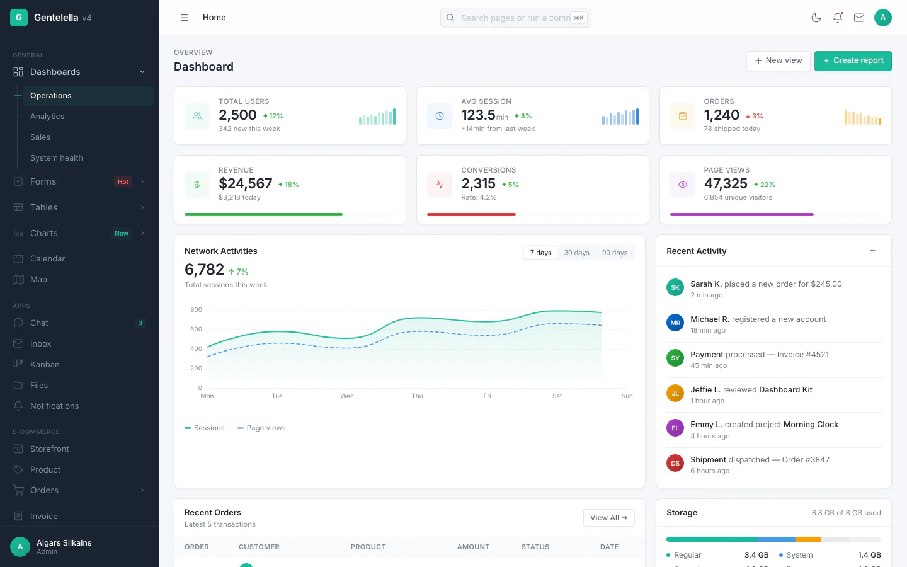
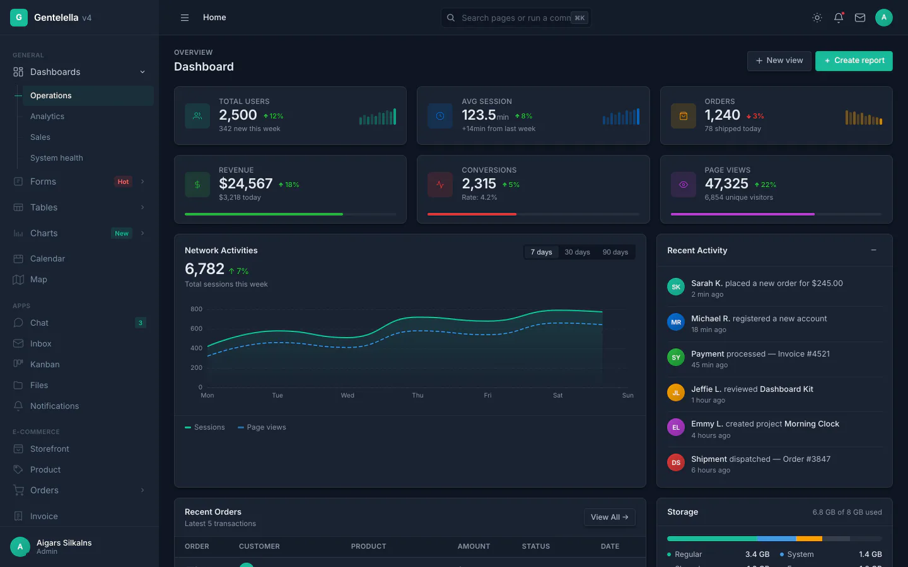
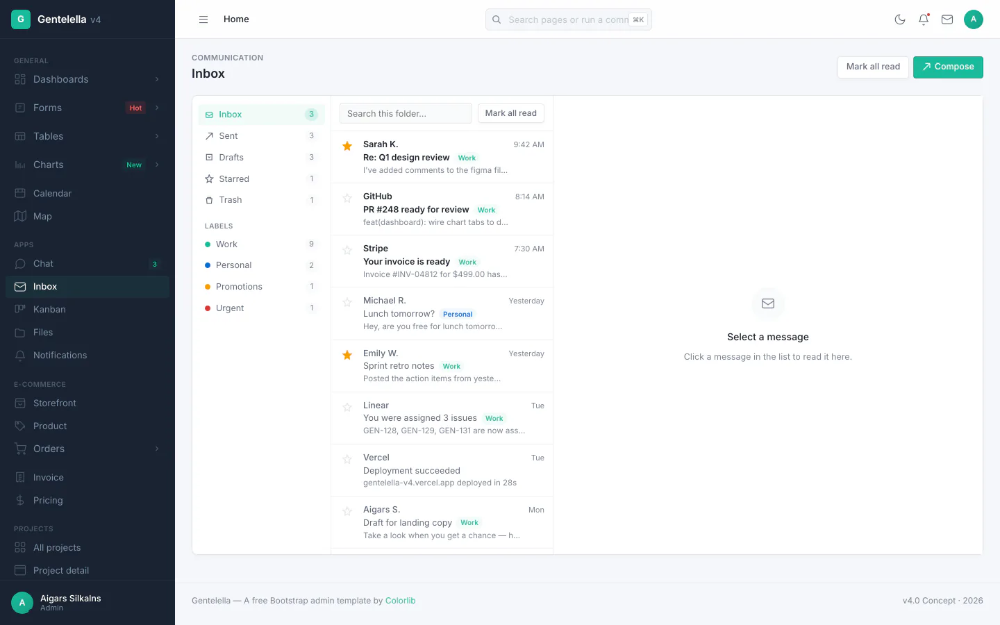
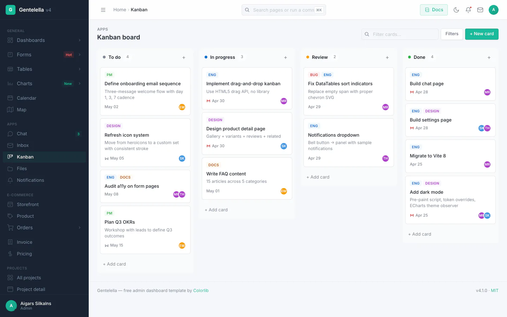
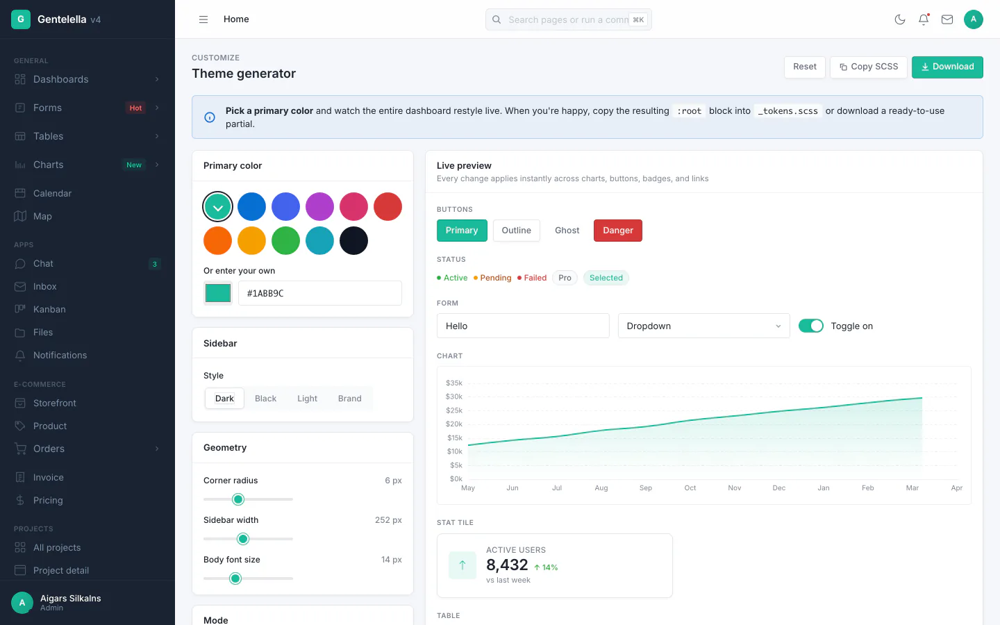

# Gentelella v4 — 免费后台管理模板

[English](README.md) | **简体中文**

[](https://www.npmjs.com/package/gentelella)
[](https://www.npmjs.com/package/gentelella)
[](https://www.jsdelivr.com/package/npm/gentelella)
[](https://github.com/ColorlibHQ/gentelella/stargazers)
[](LICENSE.txt)
[](https://vitejs.dev/)
[](#技术栈)
[](#技术栈)

**Gentelella v4** 是一套免费开源的**后台管理模板**，基于**原生 JavaScript**、**SCSS** 和 **Vite 8** 构建。**不依赖 Bootstrap，不依赖 jQuery，不依赖任何 SPA 框架。** 适合用作 SaaS 控制台、CRM 系统、企业内部工具、电商后台以及项目管理应用的界面基础，是 Bootstrap 后台模板的现代替代方案。

包含 **58 个生产级 HTML 页面**、**20 种 ECharts 图表**、功能完整的**收件箱 / 看板 / 日历 / 文件管理器 / 设置页**，以及**实时主题生成器**、**组件演练场**、**⌘K 命令面板**、**深色模式**和 **PWA 支持**。采用 MIT 许可证，个人与商业项目均可免费使用。

由 [Colorlib](https://colorlib.com) 为 2026 年打造。**[在线演示 →](https://preview.colorlib.com/theme/gentelella/)**

<p align="center">
  <a href="https://preview.colorlib.com/theme/gentelella/production/index.html">
    
  </a>
  <a href="https://preview.colorlib.com/theme/gentelella/production/index.html">
    
  </a>
</p>

<p align="center">
  <em>收件箱 · 看板 · 主题生成器</em><br>
  <a href="https://preview.colorlib.com/theme/gentelella/production/inbox.html">
    
  </a>
  <a href="https://preview.colorlib.com/theme/gentelella/production/kanban.html">
    
  </a>
  <a href="https://preview.colorlib.com/theme/gentelella/production/theme.html">
    
  </a>
</p>

> **自己生成截图** — 执行 `npm run build && npm run screenshots`，Playwright 会截取 22 个关键页面 × 浅色/深色两种主题，共 44 张 PNG 输出到 `docs/screenshots/`，同时生成本文档使用的 WebP 缩略图（需要 `cwebp`，可通过 `brew install webp` 安装）。

---

## 为什么选择 Gentelella v4

初代 Gentelella 自 2014 年起就是一套免费的 Bootstrap 后台模板，累计**下载量超过 300 万次**，[GitHub Star 超过 21k](https://github.com/ColorlibHQ/gentelella)。v4 是一次彻底的重构：

- **不依赖 Bootstrap，不依赖 jQuery** — 纯原生 JavaScript + SCSS。`node_modules` 约 165 MB（v2 时约为 600 MB）。
- **Vite 8 构建系统** — 即时 HMR、多页面应用、入口自动发现、资源文件名哈希。
- **浅色 + 深色主题**，自动识别 `prefers-color-scheme`，并通过首屏前置脚本消除主题闪烁。
- **PWA 就绪** — 可安装到桌面和移动端，支持离线外壳与 Service Worker。
- **面向 AI 辅助开发** — 内置 Claude Code、Cursor、GitHub Copilot 以及任意兼容 [agents.md](https://agents.md) 工具的上下文文件。

适用场景：**SaaS 控制台**、**CRM**、**ERP**、**企业内部管理后台**、**项目管理工具**、**电商后台**、**数据分析看板**、**人力/薪酬系统**、**预订系统**、**内容管理系统**。

## 功能特性

- **🎨 实时主题生成器** — 选定主色后，所有图表、按钮、徽章和链接会实时换肤，并可复制或下载生成的 SCSS 变量。演示：[theme.html](https://preview.colorlib.com/theme/gentelella/production/theme.html)
- **🧪 组件演练场** — 所有可复用组件集中在一个页面，每个组件旁附带**其确切的 HTML 源码**和一键复制按钮。演示：[playground.html](https://preview.colorlib.com/theme/gentelella/production/playground.html)
- **⌘K 命令面板** — 对全部 58 个页面及页内操作进行模糊搜索
- **📬 完整的收件箱客户端** — 文件夹、阅读面板、写信弹窗、回复/转发、J/K/R/S/# 快捷键，以及当前文件夹内搜索
- **📱 PWA** — 可安装到 macOS / Windows / iOS / Android，支持离线外壳与 Service Worker
- **↔️ 侧边栏图标模式** — 桌面端点击汉堡按钮可将侧边栏收起为纯图标，悬停显示提示，点击弹出子菜单
- **🌗 深色模式** — 自动识别 `prefers-color-scheme`，前置脚本消除闪烁，手动切换结果保存在 `localStorage`
- **↔️ RTL 支持** — 通过 `<html dir="rtl">` 支持阿拉伯语 / 希伯来语 / 波斯语布局，基于 CSS 逻辑属性实现（无需维护镜像样式表）。详见 [docs/rtl.md](docs/rtl.md)
- **♿ 无障碍** — 跳转链接、键盘焦点样式、交互控件的 ARIA 标签、语义化地标区域，以及对屏幕阅读器友好的 DataTables

## 包含内容

| 模块 | 具体内容 |
| --- | --- |
| **仪表板** | 4 种变体 — 运营、数据分析（热力图、漏斗图、同期群矩阵）、销售（仪表盘、雷达图、销售管线）、系统健康（资源占用条、部署列表、错误日志） |
| **登录鉴权** | 登录 · 社交登录（Google、GitHub）· 注册 · 找回密码 · 两步验证 · 锁屏 · 403 / 404 / 500 |
| **表单** | 基础表单 · 高级控件 · 6 步向导 · 拖拽上传 · 校验 · **日期区间选择器 · 多选框 · 富文本编辑器** |
| **表格** | DataTables — 排序、搜索、分页、**行选择、CSV 导出** · 23 行与 50 行两种示例 |
| **图表** | **20 种 ECharts 图表** — 折线图、面积图、堆叠面积图、柱状图、条形图、柱线混合图、环形图、饼图、雷达图、仪表盘、散点图、热力图、漏斗图、K 线图、极坐标柱状图、矩形树图、桑基图、日历热力图、甘特图，以及仪表板迷你折线图 |
| **应用页面** | 日历（完整增删改查）· 收件箱（文件夹、写信、阅读）· 聊天（8 个会话）· 看板（拖拽）· 文件管理器（树形 + 网格）· 通知 · 发票（可编辑明细行）· 个人资料 · 设置（持久化）· 常见问题 |
| **电商** | 店铺首页 · 商品详情 · 订单列表 · 订单详情 · 价格方案 |
| **管理** | 联系人 · 用户管理（搜索、筛选、角色编辑）· 维护页 · 即将上线页 |
| **UI 组件库** | **组件演练场** · **主题生成器** · 14 个分类共 120+ 图标 · 排版 · 18 种小部件 · 媒体画廊 · 通用元素（横幅、手风琴、抽屉、气泡卡片、时间线） |
| **地图** | 基于 Leaflet 的客户分布地图 |
| **营销** | 落地页，含主视觉、数据条、功能介绍、案例展示、用户评价、常见问题 |
| **布局** | 固定侧边栏 / 固定页脚 / 嵌套页面 / 空白起始页 |

此外还包括：10 个 SCSS 分片 · 构建期 + 运行期双重外壳渲染（无 FOUC）· 通过 `data-page` 属性自动高亮导航 · 移动端抽屉与桌面端图标模式 · 基于 `prefers-color-scheme` 的浅色/深色主题与前置脚本 · 跨文档视图过渡 · 跳转到主内容链接 · 键盘 `focus-visible` 焦点样式 · 带 sessionStorage 记忆的手风琴侧边栏 · 使用 `localStorage` 持久化的设置页 · 构建时自动注入的逐页 **`<meta description>`**、**Open Graph** 和 **Twitter Card** 标签。

## 升级到高级版仪表板

需要更多高级功能、专属技术支持和可直接投产的代码？欢迎访问 [DashboardPack](https://dashboardpack.com/?utm_source=github&utm_medium=readme&utm_campaign=gentelella) 查看我们精选的专业后台模板。

| 模板 | 说明 |
| --- | --- |
| [**Apex Dashboard**](https://dashboardpack.com/theme-details/apex-dashboard-nextjs/?utm_source=github&utm_medium=readme&utm_campaign=gentelella) | Next.js 16 + React 19 + Tailwind CSS v4 + shadcn/ui。5 种仪表板变体，20+ 应用页面，125+ 路由，完整增删改查。 |
| [**Zenith Dashboard**](https://dashboardpack.com/theme-details/zenith-shadcn/?utm_source=github&utm_medium=readme&utm_campaign=gentelella) | Next.js 16 + React 19 + Tailwind CSS v4 + shadcn/ui。极简无彩色设计，50+ 页面，6 种仪表板，实时主题定制器。 |
| [**Haze**](https://dashboardpack.com/theme-details/haze-dashboard-nuxt/?utm_source=github&utm_medium=readme&utm_campaign=gentelella) | Nuxt 4 + Nuxt UI v4 + Tailwind CSS v4。92+ 页面，7 种布局，5 种仪表板，支持 RTL、i18n 和模拟 API 层。 |

**[查看全部高级模板 →](https://dashboardpack.com/?utm_source=github&utm_medium=readme&utm_campaign=gentelella)**

## 技术栈

- **Vite 8**（基于 Rolldown）— 多页面应用，58 个自动发现的入口
- **SCSS**，使用 `@use` 模块化 — 无 Bootstrap，无 CSS 框架
- **原生 ES2022** — 无 jQuery，无 SPA 框架，无构建期 JSX
- **Apache ECharts 6** — 按需懒加载，仅打包实际用到的图表类型
- **DataTables.net 3** 核心 — 完全重新设计样式以匹配设计系统
- **Leaflet 1.9** — 仅在地图页懒加载
- 来自 Google Fonts 的 **Inter** 字体
- **Playwright**（开发依赖）— 用于截图流水线和冒烟测试

3 个生产依赖，10 个开发依赖，`node_modules` 约 **165 MB**（旧版 Gentelella 约 600 MB）。

## 文档

完整文档见 **<https://gentelella.colorlib.com/docs/>**，覆盖 v4 的每个部分：

| 主题 | 文档 |
| --- | --- |
| 安装、构建、部署 | [getting-started](https://gentelella.colorlib.com/docs/getting-started/) |
| 目录结构 | [project-structure](https://gentelella.colorlib.com/docs/project-structure/) |
| 外壳注入与懒加载模块 | [architecture](https://gentelella.colorlib.com/docs/architecture/) |
| 设计变量、深色模式、主题生成器 | [theming](https://gentelella.colorlib.com/docs/theming/) |
| 新增页面与侧边栏条目 | [adding-pages](https://gentelella.colorlib.com/docs/adding-pages/) |
| 组件演练场 | [playground](https://gentelella.colorlib.com/docs/playground/) |
| ECharts 工厂函数 | [echarts](https://gentelella.colorlib.com/docs/echarts/) |
| DataTables、行选择、CSV 导出 | [tables](https://gentelella.colorlib.com/docs/tables/) |
| 输入框、校验、自定义控件 | [forms](https://gentelella.colorlib.com/docs/forms/) |
| `showModal`、`showToast`、`openMenu` | [overlays](https://gentelella.colorlib.com/docs/overlays/) |
| ⌘K 命令面板 | [command palette](https://gentelella.colorlib.com/docs/palette/) |
| 收件箱客户端 | [inbox](https://gentelella.colorlib.com/docs/inbox/) |
| 看板 | [kanban](https://gentelella.colorlib.com/docs/kanban/) |
| Vite 多页面配置 | [vite-build](https://gentelella.colorlib.com/docs/vite-build/) |
| Service Worker、manifest、离线 | [pwa](https://gentelella.colorlib.com/docs/pwa/) |
| 托管、子路径、缓存头 | [deployment](https://gentelella.colorlib.com/docs/deployment/) |
| 通过 `.d.ts` 获得 IntelliSense | [typescript](https://gentelella.colorlib.com/docs/typescript/) |
| 种子数据与 HTTP 后端（`?api=1`） | [data-adapter](https://gentelella.colorlib.com/docs/data-adapter/) |
| 从旧版 Gentelella 迁移 | [migration-v2](https://gentelella.colorlib.com/docs/migration-v2/) |
| 常见问题 | [FAQ](https://gentelella.colorlib.com/docs/faq/) |

## 快速开始

```bash
git clone https://github.com/ColorlibHQ/gentelella.git
cd gentelella
npm install
npm run dev
```

然后打开 [http://localhost:9173/production/index.html](http://localhost:9173/production/index.html)。开发服务器会对 SCSS、JS 和 HTML 热更新。可用 `PORT=4000 npm run dev` 更换端口。

### 生产构建

```bash
npm run build
```

会将静态 HTML 与带哈希的 JS/CSS 输出到 `dist/`。该目录可部署到任意静态托管平台（Netlify、Vercel、Cloudflare Pages、S3、GitHub Pages）。

若需部署到子路径（例如 `https://example.com/admin/`）：

```bash
BASE_PATH=/admin/ npm run build
```

### npm 包

本项目也可作为 npm 依赖使用，以便按需引入：

```bash
npm install gentelella
```

```js
import { mountShell, showModal, showToast } from 'gentelella';
import 'gentelella/scss/v4/main.scss';
```

子路径导出：`gentelella/v4/*`（JS 模块）、`gentelella/scss/*`（样式）、`gentelella/types`（TypeScript 声明）。

### CDN（jsDelivr）

npm 包中同时包含预构建的 `dist/` 和未打包的 `src/`，因此无需构建工具即可通过 [jsDelivr](https://www.jsdelivr.com/package/npm/gentelella) 访问任意文件。适合快速原型、查看设计系统实现，或单独引入某个 ES 模块：

```html
<!-- 单独引入 ES 模块辅助函数 —— src/v4/ 下的路径是稳定的 -->
<script type="module">
  import { showModal } from 'https://cdn.jsdelivr.net/npm/gentelella@4/src/v4/modal.js';
  import { showToast } from 'https://cdn.jsdelivr.net/npm/gentelella@4/src/v4/toast.js';
  showToast('Hello from CDN', { variant: 'success' });
</script>
```

也可以直接从 CDN 浏览 58 个已构建的演示页面，所有静态资源都能正确解析：

```text
https://cdn.jsdelivr.net/npm/gentelella@4/dist/production/index.html
https://cdn.jsdelivr.net/npm/gentelella@4/dist/production/inbox.html
https://cdn.jsdelivr.net/npm/gentelella@4/dist/production/kanban.html
…
```

**关于文件哈希的提醒。** Vite 会为 `dist/assets/` 和 `dist/js/` 下的资源生成内容哈希文件名（如 `main-v4-DDS6x4g-.css`），因此这些文件的 CDN 直链会随每次发布而变化。此外 `src/main-v4.js` 入口会导入 SCSS 源文件，无法直接在浏览器中加载，需要配合打包工具使用。如果你需要类似 AdminLTE 那样带稳定 URL 的单文件 `<script src>` 引入方式，请改用 npm 包并自行打包。Gentelella v4 在 CDN 场景下的优势在于浏览演示页面和按需引入 `src/v4/*` 中的独立 ES 模块。

### 脚本命令

```text
npm run dev              启动 Vite 开发服务器（端口 9173）
npm run build            生产构建到 dist/
npm run build:dev        非压缩构建（便于调试）
npm run preview          本地预览 dist/ 构建产物（端口 9174）
npm run analyze          构建并打开打包体积树图
npm run new -- <slug>    脚手架生成新页面（参数见 `--help`）
npm run screenshots      启动 Playwright 并生成 44 张截图到 docs/screenshots/
npm run smoke            启动开发服务器，遍历所有页面并断言返回 200
npm run deploy:preview   构建并同步到 R2，按文件类型设置缓存头
npm run lint             对 src/ 执行 ESLint
npm run format           对 src/ 执行 Prettier 格式化
```

## AI 辅助开发

Gentelella v4 为主流 AI 编程工具内置了上下文文件 —— 用任意一款工具打开本仓库，助手就能立即获得关于架构、约定与常用范式的准确信息：

| 工具 | 文件 |
| --- | --- |
| **Claude Code** | [`CLAUDE.md`](CLAUDE.md) |
| **Cursor** | [`.cursor/rules/project.mdc`](.cursor/rules/project.mdc) |
| **GitHub Copilot** | [`.github/copilot-instructions.md`](.github/copilot-instructions.md) |
| **Aider、Cline、Codex、Continue**（以及其他 [agents.md](https://agents.md) 兼容工具） | [`AGENTS.md`](AGENTS.md) |

每个文件都记录了硬性规则（仅使用原生 DOM、单一入口、通过 body 属性启用外壳、导航配置集中于一个常量、统一的浮层辅助函数、颜色一律使用 CSS 自定义属性、子路径安全的 URL）、需要避免的反模式，以及可直接复制的新增页面、图表、弹窗和提示的范式。

## 项目结构

```text
src/
├── main-v4.js                 入口 —— 挂载外壳，初始化图表/表格
├── v4/
│   ├── shell.js               运行时：移动端抽屉、主题切换、下拉菜单
│   ├── shell-render.js        纯函数：导航配置 + 侧边栏/顶栏/页脚 HTML
│   ├── charts.js              ECharts 工厂函数（营收、销售、环形图等）
│   ├── tables.js              针对 [data-datatable] 的 DataTables 初始化
│   ├── menus.js               气泡菜单与侧边面板
│   ├── modal.js               弹窗系统
│   ├── toast.js               轻提示
│   ├── command-palette.js     ⌘K 模糊搜索
│   ├── calendar.js            月视图日历
│   ├── inbox.js               收件箱文件夹与邮件列表
│   ├── kanban.js              支持拖拽的看板
│   ├── file-manager.js        树形 + 网格文件浏览器
│   ├── form-controls.js       日期区间、多选、富文本
│   ├── settings.js            基于 localStorage 的设置页
│   ├── details.js             项目/订单/联系人详情面板
│   ├── markup.js              用于 JS 渲染内容的纯字符串辅助函数
│   ├── data-adapter.js        用于后端数据填充的种子与 HTTP 适配器
│   ├── product-images.js      商品图片放大
│   └── product-mockups.js     SVG 商品样机
└── scss/v4/
    ├── main.scss              @use 聚合入口
    ├── _tokens.scss           CSS 自定义属性（颜色、侧边栏、字体、圆角）
    ├── _layout.scss           侧边栏、顶栏、主区域、栅格、页脚、响应式
    ├── _components.scss       按钮、卡片、表格、状态、开关、进度条
    ├── _forms.scss            输入框、下拉框、校验、输入组
    ├── _widgets.scss          统计卡片、动态、环形图、迷你折线、待办
    ├── _pages.scss            分页、提示、日历、收件箱、发票等
    ├── _datatable.scss        DataTables 样式覆盖
    ├── _auth.scss             登录与错误页布局
    └── _apps.scss             聊天、看板、文件管理器、设置

production/                    58 个入口 HTML 页面 —— 每个界面一个
public/                        原样复制的静态资源
dist/                          构建产物（已 gitignore）
types/gentelella.d.ts          TypeScript 声明
vite.config.js                 多页面 Vite 配置
```

## 自定义

### 设计变量

所有颜色、圆角、侧边栏尺寸和字体设置都以 CSS 自定义属性的形式集中在 [`src/scss/v4/_tokens.scss`](src/scss/v4/_tokens.scss)。修改 `:root` 后保存，Vite 开发服务器会自动刷新。

想换品牌色？修改 `--primary` 和 `--primary-dk` 即可，所有图表、按钮和高亮导航项都会同步更新 —— ECharts 在初始化时会读取这些变量。

### 新增页面

推荐方式：

```sh
npm run new -- reports --title "Reports" --pretitle "Admin" \
  --breadcrumb "Home > User management|user_management.html > Reports" \
  --nav-group "Admin" --icon "profile"
```

该命令会创建带标准骨架的 `production/reports.html`，并在指定 `--nav-group` 时把侧边栏条目写入 [`src/v4/shell-render.js`](src/v4/shell-render.js) 的 `NAV` 数组。Vite 会自动发现新入口，无需修改配置。执行 `npm run new -- --help` 查看全部选项，或用 `--dry-run` 预览而不写入文件。

手动方式：

1. 复制 `production/` 下任意页面（例如 `profile.html`）作为起点。
2. 更新 `<title>`、`data-page` 和 `data-breadcrumb` 属性。当面包屑片段的文字与某个侧边栏条目一致时会自动变成链接（`Forms` → `form.html`）；也可以用竖线指定任意目标，例如 `data-breadcrumb="Home > Projects|projects.html > Acme Redesign"`。最后一段代表当前页面，永远不会是链接。
3. 用 v4 组件替换 `<main>` 中的内容。
4. 如需新增侧边栏条目，编辑 [`src/v4/shell-render.js`](src/v4/shell-render.js) 中的 `NAV` 数组。

外壳会根据 `data-page` 自动高亮对应的导航项。

### 新增图表

在 [`src/v4/charts.js`](src/v4/charts.js) 中按照 `revenueLine` / `salesBar` 的写法添加工厂函数，注册到 `charts` 映射中，然后在页面里放入 `<div data-chart="your-name" style="width:100%;height:300px"></div>`。颜色会自动取自设计变量。

### 新增可排序表格

写一个普通的 `<table class="table" data-datatable>`，包含 `<thead>` 和 `<tbody>` 即可，初始化会自动执行。用 `<th data-orderable="false">` 关闭某列排序，用表格上的 `data-page-length="25"` 修改每页条数。

### 侧边栏导航

侧边栏由唯一数据源渲染 —— 即 [`src/v4/shell-render.js`](src/v4/shell-render.js) 中的 `NAV` 数组。在那里修改，所有页面同步生效。

### TypeScript / IntelliSense

公开 JS 接口的类型声明位于 [`types/gentelella.d.ts`](types/gentelella.d.ts)，并通过 `package.json` 的 `types` 字段接入。VS Code 会自动解析 IntelliSense —— 无需 `tsconfig`，无需重写代码。覆盖 `mountShell`、`showModal`、`showToast`、`openMenu`、`seedAdapter`/`httpAdapter`、图表与表格初始化，以及 `NAV` 的结构。

### 标记辅助函数

对于需要由数据生成内容的页面（订单行、收件箱会话、看板卡片），[`src/v4/markup.js`](src/v4/markup.js) 提供了一组返回字符串的纯函数 —— `statTile()`、`statusBadge()`、`customerCell()`、`activityItem()`、`visitorRow()`、`emptyState()`、`banner()`、`skeletonRows()`，以及 `escapeHtml()`。实际示例见[组件演练场](https://preview.colorlib.com/theme/gentelella/production/playground.html#helpers-intro)。静态页面仍使用手写 HTML —— 这些函数是为样板代码较多的 JS 动态内容准备的。

## SEO 与元数据

每个页面在构建时都考虑了 SEO：

- **语义化 HTML5** — `<main>`、`<nav>`、`<aside>`、`<header>`，以及语义化的 `<h1>` 页面标题
- **逐页 `<meta description>`**，自动由面包屑推导
- **Open Graph + Twitter Card** 标签在构建时注入
- **PWA manifest** 与 theme-color（浅色/深色两套）
- 构建时依据已发现的页面生成 **`sitemap.xml`**，自动排除登录与错误页（通过 `SITE_URL=https://example.com/ npm run build` 启用）
- 落地页的 **JSON-LD 结构化数据** —— `SoftwareApplication`，以及构建时从页面自身 FAQ 解析出的 `FAQPage`，确保结构化数据与可见内容始终一致
- **主题前置脚本** — 消除加载时的主题闪烁
- **跳转到主内容链接** + ARIA 地标，便于屏幕阅读器导航
- **区分缓存策略的部署脚本**（[`scripts/deploy-preview.sh`](scripts/deploy-preview.sh)）— 哈希资源长缓存，HTML 短缓存，Service Worker 不缓存

## 部署

这是一套静态模板，`dist/` 可部署到任何能提供静态文件的地方。

| 托管平台 | 说明 |
| --- | --- |
| **Netlify / Vercel / Cloudflare Pages** | 直接拖入即可，无需配置。使用默认的 `BASE_PATH=/`。 |
| **GitHub Pages** | 执行 `BASE_PATH=/your-repo/ npm run build`，再把 `dist/` 推送到 `gh-pages`。 |
| **S3 / CloudFront** | 上传 `dist/`，将存储桶设为静态站点，并让 CloudFront 指向它。 |
| **任意 nginx / Apache** | `cp -r dist/* /var/www/html/`。 |
| **Cloudflare R2** | 使用内置的 [`npm run deploy:preview`](scripts/deploy-preview.sh)，会按文件类型设置缓存头。 |

无需后端。除子路径部署所需的 `BASE_PATH` 外，不需要任何环境变量。

## 刻意不包含的内容

- **没有后端。** 表单提交到 `#`，不会持久化。这是一套 UI 模板 —— 请自行对接 API。
- **没有鉴权。** 登录表单只是跳转，没有会话、令牌或校验。
- **没有实时通信。** 不含 WebSocket、SSE 或轮询。动态流和统计数据都是静态的。
- **没有状态管理。** 开关和待办勾选通过直接操作 DOM 实现。
- **没有正式的无障碍审计。** 已接入跳转链接、焦点样式、ARIA 标签和地标，但尚未进行系统性的屏幕阅读器测试。欢迎提交 PR。

## 路线图

`4.0.0` 已交付的内容详见 [`changelog.md`](changelog.md)。仍在计划中的有：

- **图片优化** — 压缩 `public/images/*.jpg`，并提供 AVIF + JPG 回退
- **Lighthouse 审计**与调优，目标 95+ 性能 / 100 无障碍 / 100 SEO / 100 PWA
- **按页面对图表类型做 tree-shaking**，进一步精简 ECharts 依赖块
- **i18n 文案提取方案**

希望优先实现其中某一项？欢迎[提交 issue](https://github.com/ColorlibHQ/gentelella/issues)。

## 许可证

MIT —— 个人与商业项目均可免费使用。详见 [`LICENSE.txt`](LICENSE.txt)。

## 致谢

Gentelella 自 2014 年起就是一套免费的 Bootstrap 后台模板，最初由 Colorlib 的 [Aigars Silkalns](https://colorlib.com) 开发。v4 是面向 2026 年的彻底重构 —— 移除了 Bootstrap 和 jQuery，代之以自成一体的设计系统。

如果 Gentelella v4 为你节省了时间，欢迎在 [GitHub](https://github.com/ColorlibHQ/gentelella) 上点个 Star —— 这能帮助更多开发者发现这个项目。
